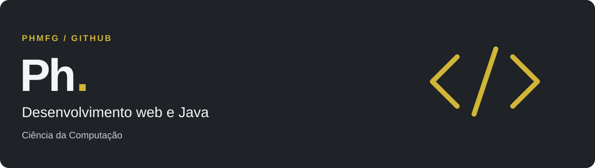

  

# Oi, eu sou o Ph =)

Estudo Ciência da Computação na Estácio e Programação Java no GC26. Sou estagiário de suporte de TI na Procempa e também desenvolvo para a web.

Por aqui, compartilho projetos e o que estou aprendendo com eles. Tenho interesse em automação, inteligência artificial e tecnologia acessível.

[LinkedIn](https://www.linkedin.com/in/paulinohenriquemfg/) · [Meus repositórios](https://github.com/PHMFG?tab=repositories)

## Tecnologias e ferramentas

Linguagens e web

  
  
  
  
  

Plataformas e frameworks

  
  
  

Dados e versionamento

  
  
  

Práticas e conceitos: orientação a objetos (POO), APIs REST e CRUD.
